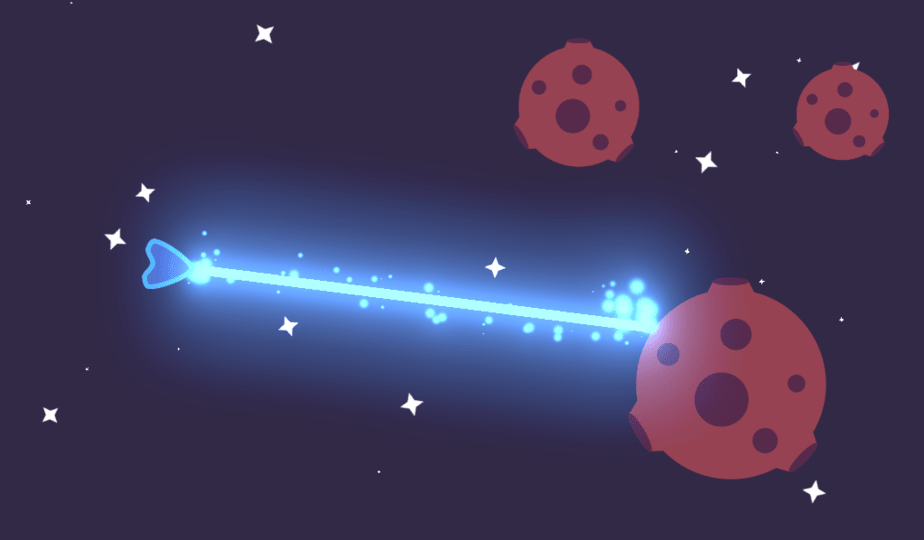
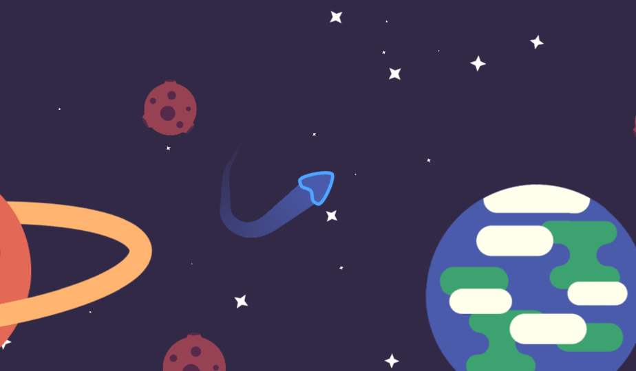
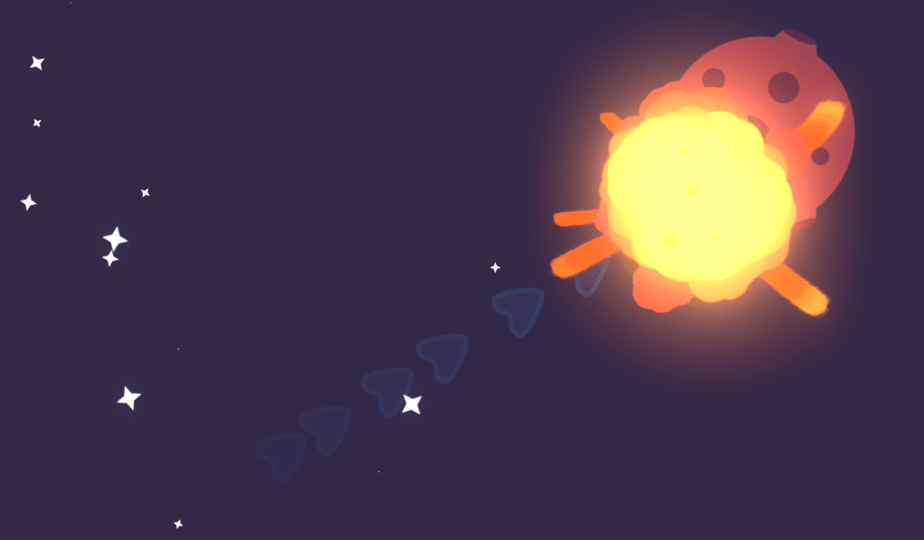

# Godot Visual Effects

Godot Visual Effects is a Free and Open-Source set of polished visual effects from our course **Godot VFX Secrets**.

ℹ Follow us on [Twitter](https://twitter.com/NathanGDQuest) and [YouTube](https://www.youtube.com/c/gdquest/) for free game creation tutorials, tips, and news. You can support our work on Free Software by [getting one of our courses](https://gdquest.mavenseed.com/).

ℹ The course isn't out yet. To know when it's available, you can [subscribe via email](https://gdquest.mavenseed.com/p/follow).

This hands-on tutorial series will teach you essential techniques to design effects such as explosions, ghost trails behind the player as in Castlevania games, lasers, background animation, and more.

## Available effects

All available effects are currently 2D-only.

- Explosion
- Laser beam
- Ghost trail or after image
- Star field
- Trail that follows the character

## How to use

Download the Godot project. Each effect is in a self-contained directory with all its dependencies.

To add an effect to your own project, copy its directory to the root of your project, and move it from Godot's _FileSystem_ tab. That's it!

## Contributing

Contributors are welcome!

If you encounter a bug, please [open an issue](https://github.com/GDQuest/godot-game-harvester/issues/new).

If you want to contribute to the project, for instance by fixing a bug or adding a feature, check out our:

1. [Contributor guidelines](https://www.gdquest.com/docs/guidelines/contributing-to/gdquest-projects/).
1. [GDScript style guide](https://www.gdquest.com/docs/guidelines/best-practices/godot-gdscript/)
