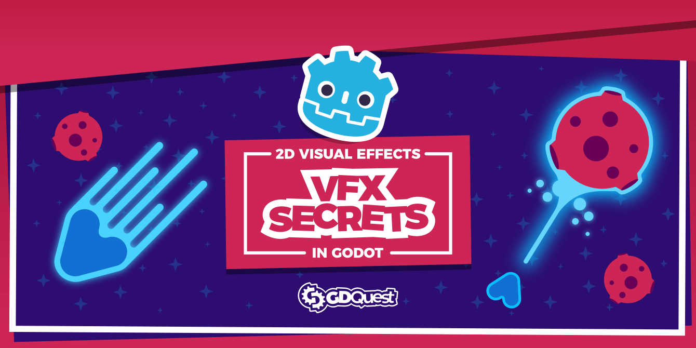

# Godot Visual Effects

⚠ This repository is a work-in-progress. To know when its content is available, [follow us on Twitter](https://twitter.com/NathanGDQuest)

This project is a Free and Open-Source set of polished visual effects from our course [Godot VFX Secrets](). They are available under the permissive MIT license

This hands-on tutorial series will teach you essential techniques to design effects such as explosions, ghost trails behind the player as in Castlevania games, lasers, background animation, and more.

## Available effects

All available effects are currently 2D-only.

- Explosion
- Laser beam
- Ghost trail or after image
- Star field
